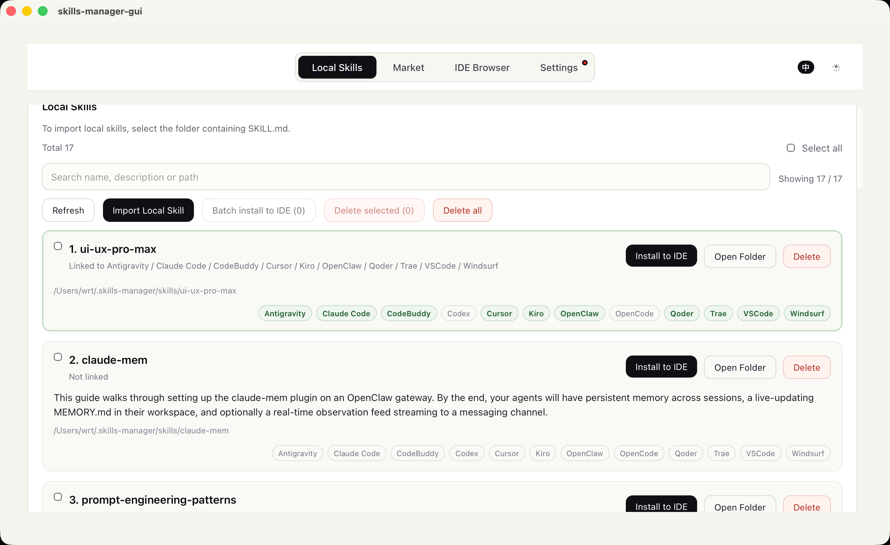
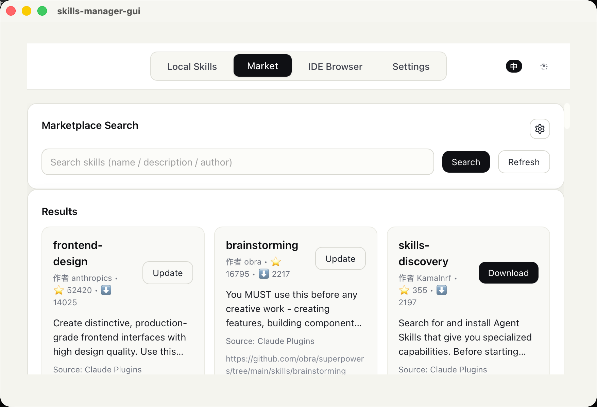
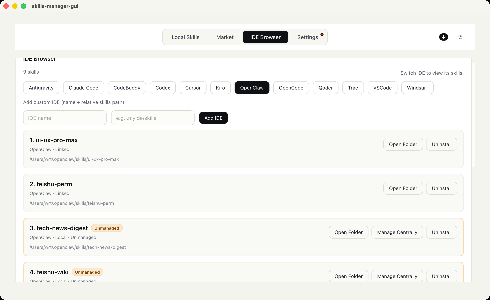
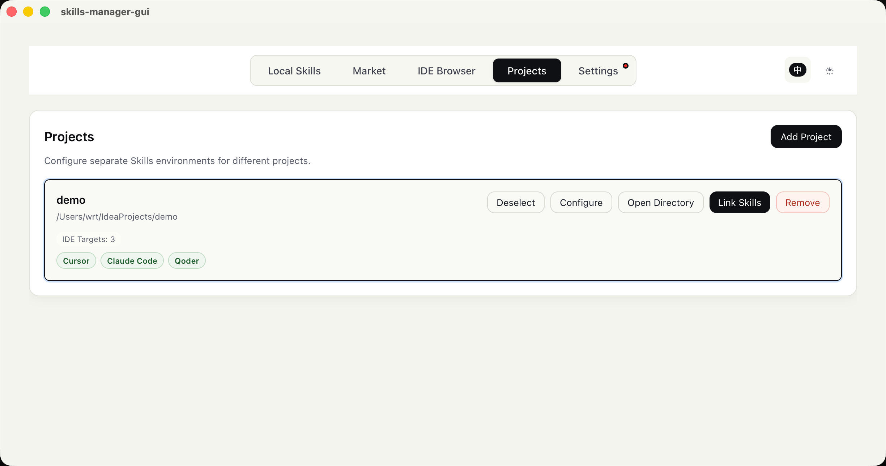

# Skills Manager

## Update snapshots and rollback

Open **My Skills → More → Version history** to restore a pre-update snapshot after confirmation. Updates of existing Skills first save complete files under `Skill Manager/.history/<snapshot ID>` and stop if snapshot creation fails. Restore preserves UUID/path and saves the current version first. Snapshots are local only, excluded from GitHub backup, not automatically cleaned, limited to 200 MiB each, and reject symlinks/junctions. This is local rollback, not upstream version detection, diff preview or conflict merging. Linked IDEs and automatic GitHub backup use the restored current content.

## Edit an existing Skill

Open **My Skills → More → Edit SKILL.md** to edit a managed Skill's complete Markdown document. Save validates the YAML frontmatter, name, UUID, description and body. UUID changes and renaming are intentionally blocked. A complete `before-edit` snapshot is created under `Skill Manager/.history/<snapshot ID>` before the file is replaced and is available in Version history.

The editor compares the file with the exact content originally loaded. If VS Code, a script or another program changes it meanwhile, saving is refused and **Reload disk version** is offered instead of silently overwriting external work. On Windows the replacement uses temporary files in the same directory and attempts to restore the original on failure. Editing never executes scripts or commands from the Skill.

## Favorites, tags and filters

**My Skills** supports favorite stars, comma-separated tags, a favorites-only filter and tag filtering. Each Skill may have up to 20 tags of 32 characters; duplicate tags are merged case-insensitively. The data is keyed by Skill UUID in `%USERPROFILE%\Skill Manager\.metadata\skill-library.json`, so it does not change the `Skills` directory layout or `SKILL.md`. Deleting a Skill retains this UUID metadata, allowing a restored Skill with the same UUID to reconnect to it.

## Recycle bin

Deleting managed Skills now moves them to `Skill Manager/.trash/<entry ID>/content` with a `record.json` containing the original path, UUID, name and deletion time. The sidebar Recycle bin supports restoring and permanent deletion (requires typing `DELETE`). No automatic cleanup or GitHub upload of recycled files occurs.

Restore preserves files/UUIDs and refuses occupied destinations or duplicate UUIDs. Package references remain; retained IDE symlinks may temporarily break and reconnect when the original path is restored. Independent IDE copies are unaffected. GitHub auto backup still mirrors removal from the active library. Moves use rename only; cross-volume failures retain the source. Disk errors may leave a batch partially completed with the completed count reported. Permanent deletion cannot be undone from the app.

## Settings center and translation configuration (Windows first)

Settings is now split into four focused pages: **Updates, Cloud backup, Appearance, and Translation**. Update checks and the in-app GitHub link now target the current `S-zhi/skills-manager` repository.

**Settings → Translation** has two configuration layers. The basic layer supports Azure Translator, DeepL, Google Cloud Translation, MyMemory, and LibreTranslate. The advanced layer supports Gemini, OpenAI Chat Completions, and Anthropic Messages, with a custom Base URL for relay services, model, temperature, and an editable System Prompt. The active engine is used for Skill preview translation and results are cached locally.

Non-sensitive values are stored at `%USERPROFILE%\Skill Manager\.metadata\translation-settings.json` without changing the `Skill Manager\Skills` layout. API keys are **kept only in process memory, never written to JSON, and never returned from the backend to the UI**; enter them again after restarting the app. Remote endpoints must use HTTPS; local relay endpoints on localhost/127.0.0.1 may use HTTP. MyMemory's public anonymous service is typically limited to about 5,000 characters/day, may change, and should not receive private Skill content.

The updater manifest now points to the current repository. New `latest.json` manifests and installers must still be signed with the private key matching the public key in `src-tauri/tauri.conf.json`. If the signing key changes, update the embedded public key as well or clients will reject the update.

## GitHub backup (Windows first)

Open **Settings → GitHub backup** to bind a repository. This is **one-way local-to-GitHub upload**, not bidirectional synchronization.

1. Install [GitHub CLI](https://cli.github.com/) and run `gh auth login --hostname github.com` with repository write access. Restart the app after installing CLI so its PATH is available.
2. Create a repository (private recommended), including a README so a branch already exists. Empty repository initialization and branch creation are not supported yet.
3. Enter `owner/repository` (or its GitHub HTTPS URL) and an existing branch such as `main`. Test the connection, review the public/private visibility and upload scope, then save the binding and select **Upload now**.
4. Optionally enable automatic uploads. The running desktop app checks every five minutes (including a five-minute wait before the first automatic check); quitting the app stops checks.

Only `Skill Manager/Skills` and `.metadata/skill-packages.json` are mirrored under the repository's `SkillManager/` directory. The local layout and UUIDs remain unchanged. Plugins, legacy storage, IDE source folders and other metadata are not uploaded. Binding settings live in `.metadata/github-sync.json`; no GitHub token is saved there. Authentication uses GitHub CLI; the token is only held in memory for requests.

Common secret/tool files are excluded: `.git`, `node_modules`, `.venv`, `__pycache__`, `.env*`, `id_rsa`, `id_ed25519`, `credentials.json`, `*.pem`, `*.key`, `*.p12`, `*.pfx`. **This is not a full secret scanner: review documents/scripts before uploading, especially to public repositories.** Text and binary files are supported, limited to 500 files / 20 MiB per snapshot and 5 MiB per file. Unreadable files, symlinks/junctions or exceeded limits abort the upload instead of committing a partial backup.

Local deletions are mirrored only within `SkillManager/` and remain recoverable from Git history. An entirely empty snapshot or missing Skills directory cannot erase the remote backup. Unchanged content creates no commit. Remote changes/conflicting backups stop the upload; branch updates are never forced and unrelated repository files are preserved. Resolve conflicts manually or choose another repository/branch. Network/permission/branch-protection errors are shown and can be retried; automatic mode retries on later cycles. Unbinding stops future uploads without deleting either local or remote files.

### Windows title bar

Windows uses a compact, theme-aware title bar named **Skill Manager**. Drag the empty title area to move the window, or double-click it to maximize/restore. Minimize, maximize/restore, and close buttons remain on the right. macOS and Linux retain their native decorations. After updating the window configuration, restart `npm run tauri dev`; browser-only previews do not show desktop window controls.

[English](README.md) | [中文](README_zh-CN.md)

**Quickly install skills to Global/Project**
A cross-platform AI Skills Manager. Search ClawHub, SkillsMP, or skills.sh, download skills into a unified local library, and install them into supported AI development environments via symlinks. Supports Windows, macOS and Linux.






## ✨ Core Features

- 🔍 **Skill Store**: Search ClawHub, SkillsMP, and skills.sh from one place
- 📦 **Unified Local Repository**: On Windows, imported and downloaded skills live in `%USERPROFILE%\Skill Manager\Skills`
- 🔎 **Discovery & Batch Import**: Recursively find `SKILL.md` files, validate them, select multiple results, and import them
- 🚀 **One-Click Installation**: Install unified local skills to target IDEs in seconds via symlinks
- 🛠️ **Multi-Dimensional Management**: Browse skills per IDE, uninstall cleanly and safely

## 🎯 Natively Supported IDEs (Alphabetical Order)

- **Antigravity**: `.gemini/antigravity/skills`
- **Claude Code**: `.claude/skills`
- **CodeBuddy**: `.codebuddy/skills`
- **Codex**: `.codex/skills`
- **Cursor**: `.cursor/skills`
- **Kiro**: `.kiro/skills`
- **OpenClaw**: `.openclaw/skills`
- **OpenCode**: `.config/opencode/skills`
- **Qoder**: `.qoder/skills`
- **Trae**: `.trae/skills`
- **VSCode**: `.github/skills`
- **Windsurf**: `.windsurf/skills`

## 📖 Usage Guide

### 📥 Installation & Usage

- **General Users (Recommended)**: Simply head to the [Releases page](https://github.com/S-zhi/skills-manager/releases) to download the latest executable installer.
- **Developers**: Clone the source code repository to run locally or customize in-depth.

### 🍎 macOS Security Note

Since Apple developer commercial signature is not configured yet, opening the app for the first time may trigger "App is damaged and can't be opened" or "from an unidentified developer" warnings. You can run the following terminal command to bypass it:

```bash
xattr -dr com.apple.quarantine "/Applications/skills-manager-gui.app"
```

### 🔍 1) Skill Store

- Aggregated display of available skills from configured data sources.
- Clicking download automatically adds it to your local repository. If an older version exists, an "Update" button will be highlighted instead.

### 🔎 2) Discover & Import

On the **Discover & Import** page, click **Discover Skills in Folder** and choose any Windows folder. The app recursively finds `SKILL.md` files below it. Discovery itself is read-only. You can search, filter by compliance status, select visible results or individual skills, and then click **Import selected**. Only that action copies files; source folders are never moved or deleted.

Results identify common `.agents/skills` folders and Agent CLI locations for Codex, Claude Code, Cursor, Gemini/Antigravity, VS Code/GitHub Copilot, Windsurf, Qoder, Trae, Kiro, CodeBuddy, OpenClaw, and OpenCode. Unknown locations are shown as generic `SKILL.md` skills.

Each result is marked as a standard or compatible non-standard Agent Skill. The current standard checks require:

- YAML frontmatter delimited by `---`;
- non-empty `name` and `description` fields;
- a 1–64 character lowercase `name` using letters, digits, and single hyphens only;
- a `name` matching the containing directory;
- a `description` no longer than 1024 characters.

Every folder containing `SKILL.md` remains visible, including Agent CLI-specific compatible skills. Non-standard results list the exact validation issues and may still be imported at the user's discretion.

### 🗂️ 3) My Skills and managed storage

Skills Manager creates this managed layout on Windows:

```text
%USERPROFILE%\Skill Manager\
├── Skills\       # Imported, downloaded, and centrally managed skills
├── Plugins\      # Reserved for future plugin imports
├── .metadata\    # Import records and application metadata
└── .staging\     # Temporary area used during safe imports
```

Imports are copied into `.staging` first and moved into `Skills` only after the copy succeeds. Identical skills are skipped. If a different skill has the same name, both are retained using names such as `name-2` and `name-3`. Import records are written to `.metadata\skills.json`.

Each managed skill is identified by `name + UUID`. The UUID is the immutable primary key, while `name` is only the human-readable display name, so multiple skills may share a name when their UUIDs differ. The UUID is stored in the managed copy's `SKILL.md` YAML frontmatter:

```yaml
---
name: example-skill
uuid: 550e8400-e29b-41d4-a716-446655440000
description: Example
---
```

Discovery remains read-only. An existing valid source `uuid` is displayed and preserved during import. When it is absent, the UI shows **UUID generated on import**, and a UUID v4 is written only to the copied managed skill; the scanned source is never modified. Older managed skills receive a UUID on their first scan, and later scans and marketplace updates preserve it. Updates validate both the UUID and exact target path so a same-name skill cannot be overwritten accidentally.

The legacy `%USERPROFILE%\.skills-manager\skills` repository is not migrated or deleted. It remains scanned, visible, and usable, and its entries are marked **Legacy repository**. New imports, marketplace downloads, and centrally managed skills use `%USERPROFILE%\Skill Manager\Skills`.

The **My Skills** page shows skills from both repositories and lets you install them into one or more built-in or custom IDE targets.

| Operation | Copies into managed storage | Behavior |
| --- | --- | --- |
| Discover Skills in Folder | No | Read-only recursive scan with provider and compliance status |
| Import discovered skills | Yes | Batch-copies selected skills into `Skill Manager\Skills` |
| Import Local Skill | Yes | Copies one selected skill folder into `Skill Manager\Skills` |
| Manage Centrally | Yes | Copies an IDE skill into managed storage, then replaces it with a link |
| Marketplace download | Yes | Downloads and extracts into managed storage |
| Install to IDE | Usually no | Prefers a symlink; Windows falls back to a directory junction |
| Install to Qoder on Windows | Yes | Uses a managed copy with a `.skills-manager-source` marker |

The `Plugins` directory currently establishes the future extension layout only; plugin discovery and import are not implemented in this version.

### Create a Skill

Select **New Skill** in the sidebar, enter a name, description and Markdown instructions, and optionally preview `SKILL.md`. Creation writes `%USERPROFILE%\Skill Manager\Skills\<name>\SKILL.md` with a generated UUID and refreshes My Skills. Existing folders are never overwritten. Names follow Agent Skill naming rules and cannot use Windows reserved names; descriptions are limited to 1024 characters and instructions to 1 MB. The form survives navigation during the session, but drafts are not persisted after closing the app.

### Skill packages

The **My Skills** page displays Skills in collapsible groups. Create or rename packages there, assign one Skill from its More menu, assign selected Skills in bulk, and drag the blue handle to reorder packages. Uncategorized Skills stay in the built-in **Uncategorized** group. Package numbers start at 1.

Packages are logical groups and each Skill belongs to at most one package. Reassigning a Skill removes it from its previous package. No Skill files are moved, copied, or edited by package operations. Configuration is stored in `%USERPROFILE%\Skill Manager\.metadata\skill-packages.json` using schema v2; every package has an immutable UUID plus name, description, member UUIDs, display position, and timestamps.

Deleting a package preserves its member files and returns them to Uncategorized. Existing schema-v1 data migrates deterministically; if a Skill belonged to several packages, its first package in the saved order wins.

Package configuration import, online publishing, dependency resolution, and package version management are outside this release.

### ⌨️ 4) IDE Browser

- Switch workspace perspective (e.g., VSCode or Cursor) to view mounted skills for each IDE.
- Safe Uninstallation: Removes the symlink if linked, or deletes the physical directory if not a symlink.
- Can't find your IDE? Click "Add Custom IDE" in the top right to register its skills directory.

## 👨‍💻 Installation & Development

### Prerequisites

- Node.js (LTS recommended)
- Rust (installed via rustup)
- Windows: Visual Studio 2022 Build Tools with **Desktop development with C++** selected (MSVC, Windows SDK, and `link.exe`)
- macOS: Xcode Command Line Tools

### Windows Quick Preview

Run these commands in **Developer PowerShell for VS 2022**:

```powershell
npm install
npm run tauri dev
```

The Tauri configuration uses npm, so pnpm is not required. `link.exe not found` means the Visual C++ build tools are missing or the current terminal has not loaded the MSVC environment. Install the component above and reopen Developer PowerShell. If port `1420` is already in use, close the previous app/Vite terminal before retrying.

### Build & Release

```powershell
npm run tauri build
```

## 📡 Remote Data Sources

- **ClawHub**: anonymous `https://clawhub.ai/api/v1/search`; only native ClawHub records are shown, while mirrored skills.sh entries are filtered out.
- **SkillsMP**: anonymous official `https://skillsmp.com/api/v1/skills/search` with pagination and daily quota metadata.
- **skills.sh**: anonymous compatibility `https://skills.sh/api/search`, the endpoint used by the official CLI. It has no formal stability or quota guarantee.

Open **Skill Store**, choose a provider, enter a keyword such as `pdf` or `frontend`, and search. Results can be downloaded individually or selected in batches. Already imported skills retain their Update button. Downloads appear in **My Skills** under `Skill Manager/Skills`; failed downloads can be retried in the Skill Store.

SkillsMP anonymous quotas are currently 50 requests/day and 10/minute (subject to platform policy). Search first pages are cached for ten minutes; Refresh bypasses the application cache. Queries are sent only to the selected provider; local Skill contents are not uploaded, and provider errors never fall back to another source.

Results show descriptions, authors, GitHub stars and source links. Unsupported URLs remain visible with downloading disabled. Review source, license and scripts before use; downloading does not execute scripts or certify safety. Downloads still fetch the repository ZIP first (maximum 50 MiB), then extract the selected directory. For large repositories, obtain the desired Skill separately and use local import. Missing linked directories or missing `SKILL.md` produce an error instead of importing unrelated content.

## 🛠 Tech Stack

- Desktop Runtime Framework: **Tauri 2**
- Frontend UI Layer: **Vue 3** + **TypeScript** + **Vite**
- System Operations Layer: **Rust** (Command side)

## 📄 License

TBD
