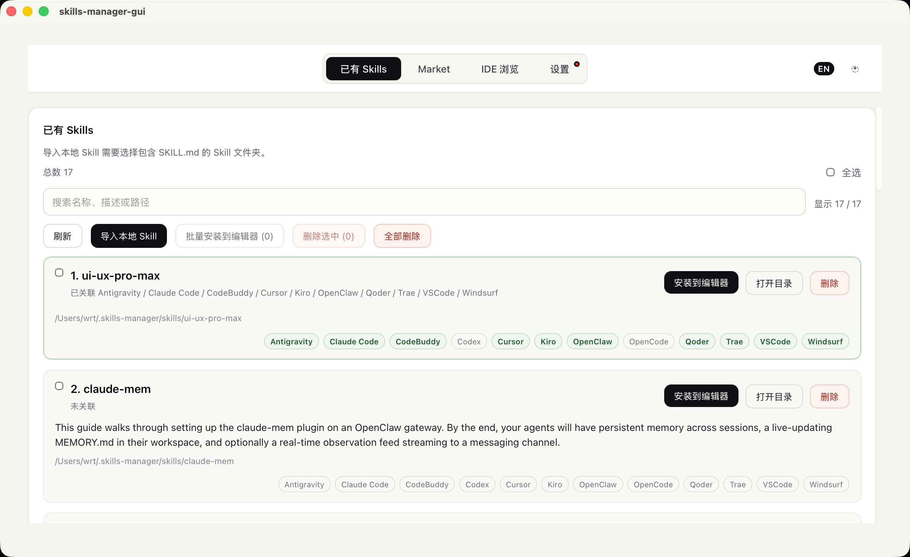
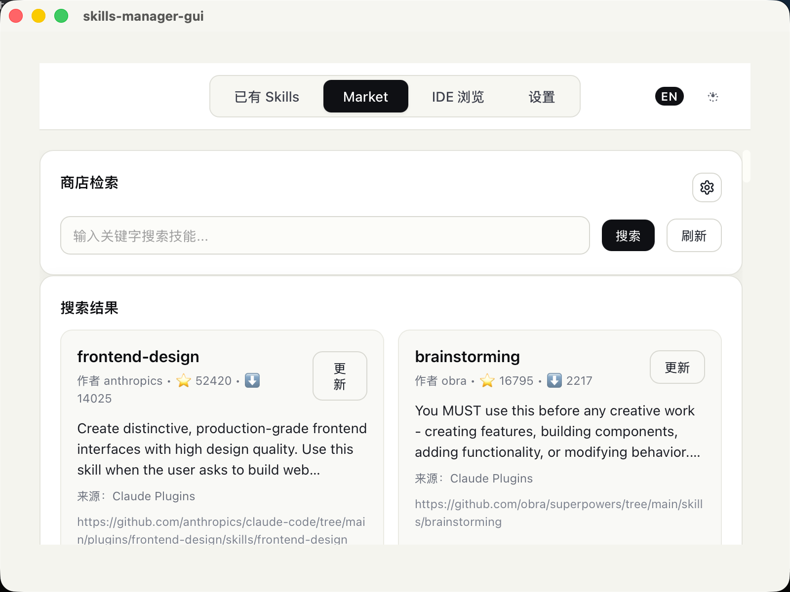
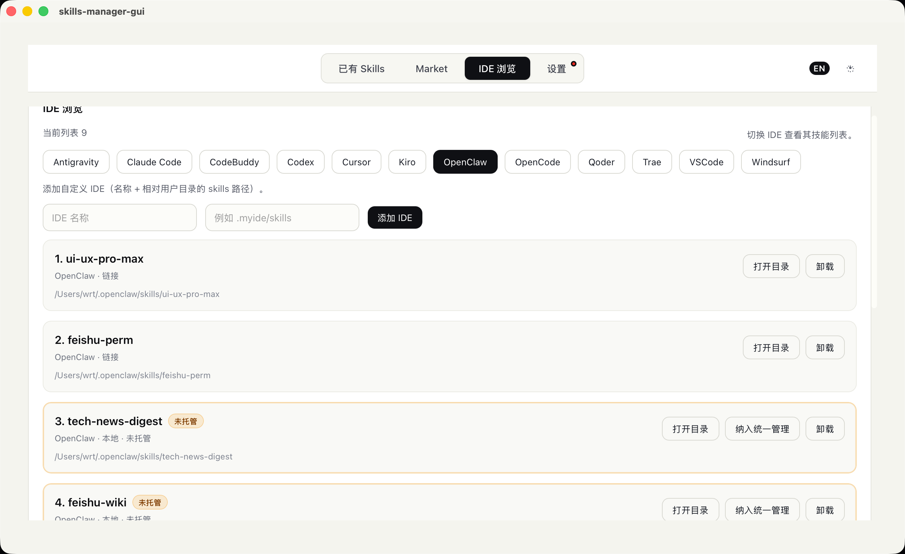

# Skills Manager

## 更新快照与回滚

“我的 Skills → 更多 → 版本历史”可查看更新前的完整文件快照，确认后恢复。更新已有 Skill 前，自动保存到 `Skill Manager/.history/<快照 ID>`；保存失败会阻止更新。恢复保留原路径与 UUID，并先保存当前版本，便于撤销回滚。快照仅存在本机，不上传到 GitHub，不自动清理；单次快照限 200 MiB，拒绝符号链接与 junction。

此版本提供本地历史恢复，不代表已实现上游新版本检测、更新差异预览或本地修改冲突合并。恢复会替换当前文件，现有 IDE 链接将使用恢复后的内容；开启 GitHub 自动备份会同步当前恢复结果。

## 编辑已有 Skill

在 **我的 Skills → 更多 → 编辑 SKILL.md** 中可直接编辑托管 Skill 的完整 Markdown 文档。保存前会校验 YAML frontmatter、名称、UUID、描述和正文；当前编辑器不允许修改 UUID 或重命名 Skill。保存成功前会在 `Skill Manager/.history/<快照 ID>` 创建“编辑前”完整快照，可从“版本历史”恢复。

编辑器读取文档时会记住原始内容；若文件随后被 VS Code、脚本或其他程序修改，保存会被拒绝并显示“重新加载磁盘版本”，不会静默覆盖外部更改。Windows 上保存采用同目录临时文件替换，替换失败时尝试恢复原文件。编辑功能只修改 `SKILL.md`，不会执行其中的脚本或命令。

## 收藏、标签与筛选

“我的 Skills”支持星标收藏、为单个 Skill 添加逗号分隔的标签，以及按“仅看收藏”或某个标签筛选。标签最多 20 个，每个最多 32 个字符；重复标签按大小写不敏感合并。收藏和标签按 Skill UUID 保存在 `%USERPROFILE%\Skill Manager\.metadata\skill-library.json`，不会改变 `Skills` 目录布局或写入 `SKILL.md`。删除 Skill 不会自动删除这份 UUID 元数据，恢复相同 UUID 后可继续关联。

## 回收站

“我的 Skills”中的删除（含批量删除）现在移入 `Skill Manager/.trash/<回收记录 ID>/content`，不直接永久删除。旁边的 `record.json` 保存原路径、名称、UUID 和删除时间。左侧“回收站”可查看、恢复或永久删除；不会自动清理，也不会上传回收站到 GitHub。

恢复保留原文件及 UUID，返回原来的管理库路径；原目录被占用或管理库已有相同 UUID 时拒绝覆盖。Skill 包保留成员引用，恢复后可重新关联。原 IDE 符号链接可能在回收期间失效，恢复原路径后仍保留的链接可重新生效；独立复制到 IDE 的文件不受此操作影响。开启 GitHub 自动备份时，管理库中的删除仍会同步到远端，回收站不是云端备份。

永久删除需要输入 `DELETE` 二次确认，删除后不能从应用回收站恢复。只允许操作管理库中的直接 Skill 子目录；链接/junction 目录被拒绝。移动采用重命名，跨磁盘失败时保留源文件并提示。批量操作遇到磁盘错误时可能部分完成，错误提示包含已回收数量。

## GitHub 自动备份（Windows 优先）

在 **设置 → GitHub 云端备份** 中绑定自己的仓库。此版本是**本地向 GitHub 单向上传**，不是双向同步；不会下载或合并远端修改。

1. 安装 [GitHub CLI](https://cli.github.com/)，在终端运行 `gh auth login --hostname github.com` 登录，确保账号有目标仓库的写权限。安装后重启应用，使 PATH 生效。
2. 在 GitHub 创建仓库，**建议私有仓库，并勾选创建 README**。需要已有分支（通常为 `main`），暂不初始化空仓库或自动创建分支。
3. 输入 `owner/repository` 或 `https://github.com/owner/repository` 和分支名，点击“测试连接”，确认仓库是否公开及是否具有写权限。
4. 确认上传范围，点击“保存绑定”，再点击“立即上传”。可勾选自动上传；开启后，应用运行期间每 5 分钟检查并上传，退出应用后停止。首次自动检查也需等待一个周期。

### 存储与安全边界

- 本地文件布局不变：上传 `%USERPROFILE%\Skill Manager\Skills` 下的文件，以及 `.metadata/skill-packages.json`；远端统一放在 `SkillManager/` 下，保留 Skills 和包配置的相对路径、UUID。
- 不上传 Plugins、旧版 `.skills-manager`、IDE 原始目录、同步配置及其他管理器元数据。本地配置保存于 `Skill Manager/.metadata/github-sync.json`，不保存 GitHub Token；认证复用 GitHub CLI，Token 仅在请求时存在于进程内存。
- 排除 `.git`、`node_modules`、`.venv`、`__pycache__`、`.env*`、`id_rsa`、`id_ed25519`、`credentials.json`、`*.pem`、`*.key`、`*.p12`、`*.pfx`。这不是完整的秘密扫描：**上传前仍须检查 Skill 文档、脚本等内容是否包含密码或个人资料**。公开仓库的备份所有人可见。
- 支持文本及二进制附件；每次最多 500 个文件、20 MiB，单文件最多 5 MiB。超限、不可读文件、符号链接或 Windows junction 会中止本次同步，不提交不完整备份。
- 仅更新仓库 `SkillManager/` 子目录，其他文件保持不变。本地删除会反映为该子目录中的删除，可从 Git 历史恢复；整个上传集合为空或 Skills 目录丢失时拒绝清空远端。
- 无变化不产生新提交。远端备份与上次同步不一致时停止并显示错误；并发分支修改采用非强制更新，失败不会覆盖对方提交。不会自动合并或强制推送。
- 若首次绑定时目标已有不同的 `SkillManager/` 内容，必须先人工核对或改用其他仓库/分支，不会覆盖已有备份。分支保护、权限不足或网络异常会显示失败，修复后可手动重试；自动模式会在后续周期重试。
- “解除绑定”停止后续自动上传，不删除本地 Skill，也不删除 GitHub 备份。同步过程中需等待完成后再修改绑定。

### Windows 标题栏

Windows 使用随深浅色主题切换的简洁标题栏，显示名称为 **Skill Manager**。拖动标题空白区域可移动窗口，双击可最大化/还原；右侧保留最小化、最大化/还原和关闭按钮。macOS、Linux 保留原生标题栏。更新窗口配置后，请重新运行 `npm run tauri dev`；仅在浏览器中预览不会显示桌面窗口按钮。

[English](README.md) | [中文](README_zh-CN.md)

**将 skill 快速安装到 全局/项目** 
一款跨平台 AI Skills 管理器。支持搜索内置目录或 SkillsMP 在线目录，下载到统一的本地管理库，并通过符号链接（Symlink）安装到受支持的 AI 开发环境。支持 Windows、macOS 与 Linux。





## ✨ 核心特性

- 🔍 **聚合市场检索**：基于公开 Registry，一站式搜索全网优质 Skills
- 📦 **统一本地仓库**：Windows 使用 `%USERPROFILE%\Skill Manager\Skills` 集中管理导入和下载的 Skill
- 🔎 **发现与批量导入**：递归发现任意目录中的 `SKILL.md`，检查规范后可多选导入
- 🚀 **一键极速分发**：以系统软链接形式，将统一的本地 Skills 秒级安装至各个目标 IDE
- 🛠️ **多维管理界面**：支持基于 IDE 的细粒度浏览、无痕安全卸载机制
- ⚙️ **项目管理**：支持项目管理，将 skills 挂载到项目下，可以配置项目使用的 ide

## 🎯 原生支持的 IDE（按字母顺序）

- **Antigravity**: `.gemini/antigravity/skills`
- **Claude Code**: `.claude/skills`
- **CodeBuddy**: `.codebuddy/skills`
- **Codex**: `.codex/skills`
- **Cursor**: `.cursor/skills`
- **Kiro**: `.kiro/skills`
- **OpenClaw**: `.openclaw/skills`
- **OpenCode**: `.config/opencode/skills`
- **Qoder**: `.qoder/skills`
- **Trae**: `.trae/skills`
- **VSCode**: `.github/skills`
- **Windsurf**: `.windsurf/skills`

## 📖 使用指南

### 📥 获取与使用

- **普通用户（推荐）**：直接前往 [Releases 页面](https://github.com/Rito-w/skills-manager/releases) 下载最新版本安装包即可。
- **开发者**：拉取源码在本地运行，或进行深度定制。

### 🍎 macOS 安全使用要求

由于目前暂时未配置 Apple 开发者商业证书，初次打开应用可能会遇到“已损坏，无法打开”或提示“未知的开发者”等系统拦截。作为开发者或极客用户，您可以在终端执行以下命令进行安全放行：

```bash
xattr -dr com.apple.quarantine "/Applications/skills-manager-gui.app"
```

### 🔍 1) 市场浏览 (Market)

- 基于配置好的服务源，聚合展示全网可用的优质 Skills。
- 点击下载将自动入库至本地，若本地仓库已存在较旧版本，将高亮显示“更新”按钮。

### 🔎 2) 发现与导入

在“发现与导入”页面点击“发现目录中的 Skills”，选择任意 Windows 文件夹后，应用会递归查找该目录及所有子目录中的 `SKILL.md`。扫描本身是只读操作；发现后可搜索、按规范状态筛选、全选当前结果或逐项勾选，再点击“导入选中”。只有这一步才会复制文件，源目录不会被移动或删除。

发现结果会显示 Skill 来源。应用会根据路径识别通用 `.agents/skills`，以及 Codex、Claude Code、Cursor、Gemini/Antigravity、VS Code/GitHub Copilot、Windsurf、Qoder、Trae、Kiro、CodeBuddy、OpenClaw 和 OpenCode 等 Agent CLI 的 Skill 目录；无法判断来源时显示为通用 `SKILL.md`。

每个结果都会标记是否为“规范 Agent Skill”。当前检查规则为：

- 文件包含以 `---` 开始和结束的 YAML frontmatter；
- frontmatter 包含非空的 `name` 和 `description`；
- `name` 长度为 1–64，只包含小写字母、数字和单连字符，连字符不位于首尾；
- `name` 与 Skill 目录名一致；
- `description` 不超过 1024 个字符。

只要存在 `SKILL.md` 就会展示，因此 Agent CLI 自定义的兼容 Skill 即使不满足上述规范也不会被隐藏；界面会列出具体的不规范原因。非规范结果仍允许导入，由用户自行决定是否管理。

### 🗂️ 3) 我的 Skills 与统一存储

Skills Manager 会自动创建自己的 Windows 管理目录：

```text
%USERPROFILE%\Skill Manager\
├── Skills\       # 已导入、市场下载和纳管的 Skill
├── Plugins\      # 为后续插件导入预留
├── .metadata\    # 导入记录等应用元数据
└── .staging\     # 导入时使用的临时区
```

导入先复制到 `.staging`，完整成功后再移动到 `Skills`，避免产生半成品。同名且内容完全一致时会跳过；同名但内容不同时会保留两份，并使用 `名称-2`、`名称-3` 等目录名。导入记录保存在 `.metadata\skills.json`。

每个托管 Skill 使用 `name + UUID` 标识，其中 UUID 是不可变主键，`name` 只作为可读显示名，因此同名但 UUID 不同的 Skill 可以同时存在。UUID 位于托管副本 `SKILL.md` 的 YAML frontmatter 中：

```yaml
---
name: example-skill
uuid: 550e8400-e29b-41d4-a716-446655440000
description: Example
---
```

目录发现保持只读：如果源 Skill 已有合法 `uuid`，界面会显示并在导入时沿用；如果没有，界面显示“导入时生成 UUID”，应用只在复制完成后的托管副本中生成 UUID v4，不会修改被扫描的源目录。旧托管 Skill 在首次扫描时自动补齐 UUID，后续扫描和市场更新都会保留原 UUID。更新时同时校验 UUID 和精确目标路径，避免同名 Skill 被错误覆盖。

旧目录 `%USERPROFILE%\.skills-manager\skills` 不会被迁移或删除，应用仍会扫描、展示并允许继续使用，其中的条目会标记为“旧仓库”。新的导入、市场下载和纳管内容统一进入 `%USERPROFILE%\Skill Manager\Skills`。

“我的 Skills”页面集中展示新旧仓库中的 Skill。点击“安装”，即可选择一个或多个原生 / 自定义 IDE 进行挂载。

不同操作的文件行为如下：

| 操作 | 是否复制到统一仓库 | 说明 |
| --- | --- | --- |
| 发现目录中的 Skills | 否 | 只读递归扫描并显示来源与规范状态 |
| 导入发现结果 | 是 | 将勾选的一个或多个 Skill 批量复制到 `Skill Manager\Skills` |
| 导入本地 Skill | 是 | 将用户选中的单个 Skill 目录复制到 `Skill Manager\Skills` |
| 纳入统一管理 | 是 | 先复制 IDE 中的 Skill 到统一仓库，再用链接替换原目录 |
| 从市场下载 | 是 | 下载并解压到统一仓库 |
| 安装到 IDE | 通常否 | 优先创建符号链接；Windows 下失败时使用目录联接 |
| Windows 安装到 Qoder | 是 | Qoder 目标使用副本，并写入 `.skills-manager-source` 来源标记 |

`Plugins` 目录当前只负责建立统一扩展布局，本版本尚未实现插件扫描和导入。

### 新建 Skill

点击侧栏“新建 Skill”，填写名称、描述和 Markdown 指令正文，可展开预览生成的 `SKILL.md`。创建成功后保存到 `%USERPROFILE%\Skill Manager\Skills\<名称>\SKILL.md`，自动生成 UUID，并刷新“我的 Skills”。可继续安装到编辑器或加入 Skill 包。

名称遵循 Agent Skill 命名规则，Windows 保留名称不可用；描述最多 1024 字符，正文不能为空且最多 1 MB。同名目录会拒绝创建，不会覆盖已有文件。切换页面会保留本次未提交表单，关闭应用后草稿不保留。

### Skill 包管理

在“我的 Skills”顶部可创建、编辑、查看和删除 Skill 包。包包含名称、描述、独立 UUID、成员 Skill UUID 列表及创建/更新时间。先导入 Skill，再在包编辑器中搜索和勾选成员；支持全选当前结果、清空选择，以及对包内可用成员批量安装到 IDE 或导出 ZIP。空包也可以保存。

这是逻辑分组：同一 Skill 可以加入多个包，同名 Skill 通过 UUID 区分。现有 `Skills`、`Plugins` 等文件布局不变，也不会因为创建包改写 `SKILL.md`；唯一新增的持久文件是 `%USERPROFILE%\Skill Manager\.metadata\skill-packages.json`：

```json
{
  "schemaVersion": 1,
  "revision": 1,
  "packages": [{
    "id": "07316a93-3b5c-40ac-94af-83aad5d43efb",
    "name": "写作工具包",
    "description": "用于资料整理和文档写作",
    "skillUuids": ["550e8400-e29b-41d4-a716-446655440000"],
    "createdAt": 1790000000,
    "updatedAt": 1790000000
  }]
}
```

删除包只删除分组配置，不删除成员文件。成员 Skill 被删除后，包保留引用并显示“成员缺失”，可在编辑时取消勾选移除。配置读取失败、格式损坏或版本不支持时会报错，不会覆盖已有配置。编辑冲突时，先取消编辑、刷新包列表，再重新编辑。

包导出目前复用 Skill ZIP 导出，只包含成员文件，不包含包配置；暂不支持包配置导入、在线发布、依赖解析或包版本管理。详细设计见 [Skill 包设计](docs/skill-packages.md)。

### ⌨️ 4) IDE 纬度管理 (IDE Browse)

- 灵活切换工作环境视角（如 VSCode 或 Cursor），独立查看各自已挂载使用的技能列表。
- 安全卸载模块：仅安全移除软链接；若非软链接则执行物理剔除，相互防干扰。
- 找不到您的生产力工具？只需在右上角轻松创建你的“自定义 IDE”。

## 👨‍💻 安装与开发

### 环境依赖

- Node.js (建议 LTS)
- Rust (通过 rustup 安装)
- Windows: Visual Studio 2022 Build Tools，并勾选“使用 C++ 的桌面开发”（提供 MSVC、Windows SDK 和 `link.exe`）
- macOS: Xcode Command Line Tools

### Windows 快速预览

请在 **Developer PowerShell for VS 2022** 中执行：

```powershell
npm install
npm run tauri dev
```

Tauri 配置已使用 npm，不要求安装 pnpm。若提示 `link.exe not found`，说明 Visual C++ Build Tools 未安装完整或当前终端没有加载 MSVC 环境；安装上述组件后重新打开 Developer PowerShell。若提示端口 `1420` 已占用，请先关闭上一次启动的应用和 Vite 终端，再重试。

### 打包发布

```powershell
npm run tauri build
```

## 📡 远程数据来源

- **内置目录**：应用自带的 `src-tauri/data/skills-index.json`。刷新只会重新搜索，不会联网更新目录。
- **SkillsMP 在线目录**：Rust 后端请求官方 `https://skillsmp.com/api/v1/skills/search`，无需浏览器跨域访问。第一版使用匿名接口，不需要登录或 API Key；暂不提供 Key 配置、高级筛选和 MCP 接入。
- **文件下载**：根据结果的 GitHub 源地址，复用现有下载队列。Claude Plugins、SkillsLLM 尚未接入实时搜索，也不使用第三方 ZIP 代理。

### 使用 SkillsMP 在线商店

进入 **商店 → SkillsMP · 在线搜索**，输入 `pdf`、`frontend` 等关键词。不能空白搜索或使用 `*` 通配符。支持加载更多、单项下载、全选当前已加载结果并批量下载。批量下载跳过已导入项；已有 Skill 可通过单项“更新”操作更新。

下载内容保存到 `Skill Manager/Skills`，在“我的 Skills”中管理。失败任务会在商店显示原因和重试按钮。源地址不受支持的结果仍展示，但禁用下载。

SkillsMP 当前公布的匿名配额是每天 50 次、每分钟 10 次，实际以平台政策为准。页面显示最近一次请求返回的今日剩余配额；同一搜索的首页缓存 10 分钟，“刷新”绕过应用缓存重新请求。搜索词会发送至 SkillsMP，不发送本地 Skill 内容。网络异常或配额用尽会明确报错，不会悄悄切换到内置目录。接口总数可能是估算值，翻页以 `hasNext` 为准，每个搜索最多 50 页。

下载前请检查来源、许可证及脚本内容；下载不会执行脚本，也不代表已完成安全审计。当前仍先下载 GitHub 仓库压缩包，再提取指定目录，压缩包最大 50 MiB。大型仓库可能超限，可单独获取所需 Skill 后本地导入。指定目录缺失或不含 `SKILL.md` 时停止导入，不会改为导入仓库中的其他目录。

## 🛠 技术栈

- 桌面端核心框架：**Tauri 2**
- 前端视图层：**Vue 3** + **TypeScript** + **Vite**
- 底层文件与系统逻辑：**Rust** (命令侧)

## 📄 License

TBD
